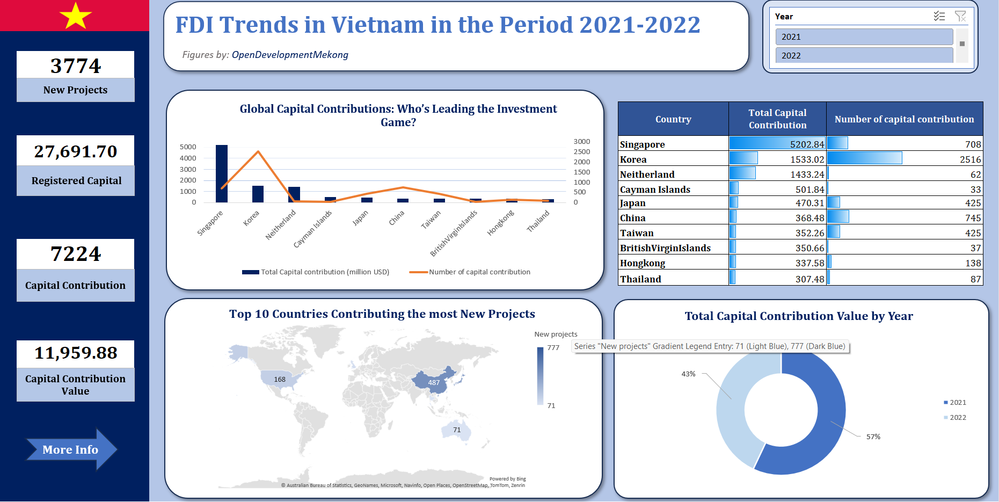
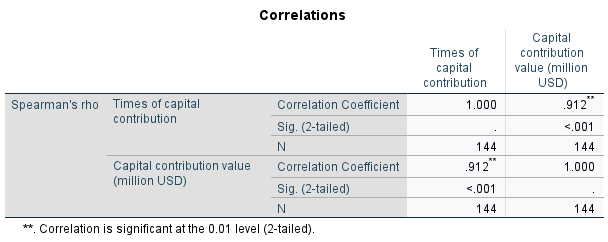
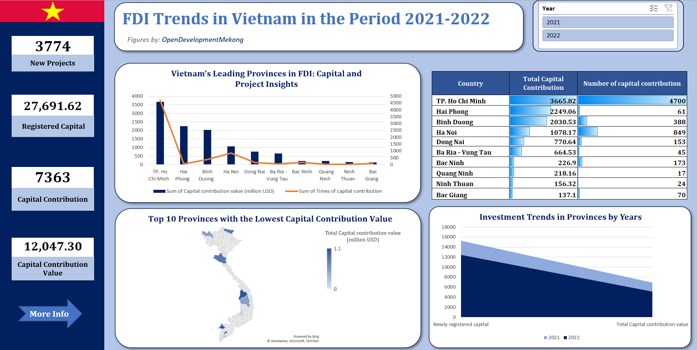
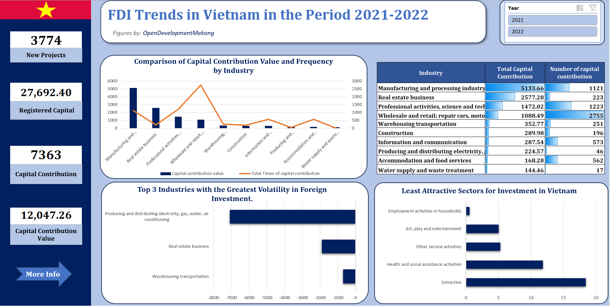

# FDI Trends in Vietnam in the Period 2021-2022
## Context
The COVID-19 pandemic had a profound impact on the economy of Vietnam and other countries worldwide. I've chosen 2021 and 2022 as comparison points to analyze how foreign direct investment (FDI) trends shifted from the height of the pandemic's effects to the period of reopening and resumption of trade. This comparison aims to uncover how FDI dynamics evolved as Vietnam transitioned from crisis management to economic recovery.
## Purpose of Analysis:

- To examine investment trends across provinces and industries in Vietnam.
- To gain a deeper understanding of the core factors driving these trends.
- To support the Ministry of Planning and Investment, along with the People's Committee, in assessing the current landscape and implementing effective policies to attract capital.
- To provide an accessible and visually engaging overview of Vietnam's FDI over the years.
## Data Source:
Visit webpage [OpenDevelopmentMekong](https://data.opendevelopmentmekong.net/dataset/fdi-investment-in-vietnam-2015-2022) to review and download datasets.
## Visualization of Analysis Results:

<em>Figure 1: FDI Contributions to Vietnam by Partner</em>

### Insights
- Singapore and South Korea are the top investors in equity capital in Vietnam, highlighting their significant role in the capital investment landscape.
- Most foreign investors come from Asian countries, reflecting strong regional diplomatic relations.
- Major developed economies, such as China, the U.S., Japan, and South Korea, have heavily invested in new projects in Vietnam.
- While the number of new projects increased by 17.1%, the total investment capital in 2022 was lower compared to the previous year, as there were fewer large-scale projects. Source: "Ministry of Planning and Investment - Foreign Investment Agency."

  

<em>Figure 2: Correlation between Total Capital contribution and Number of capital contribution</em>

I used the Spearman correlation test to examine whether there is a two-way correlation between Total Capital Contribution and Number of Capital Contributions. 
Based on the results, we can confirm that these two features are positively correlated, meaning 'when the Total Capital Contribution is high, the Number of Capital Contributions is also high.'

<em>Figure 3: FDI Contributions to Vietnam by Province</em>

### Insights
- Ho Chi Minh City stands out as the top choice for foreign direct investment (FDI), attracting the most investment capital and capital contributions.
- Hai Phong is notable for large-scale investment projects, including:
  - LG Group's electronic component factory with a total investment of $6 billion.
  - Vinfast’s automobile manufacturing plant, part of the Vingroup, with an investment exceeding $3 billion.
  - The Hai Phong International Gateway Port initiated by the Saigon Newport Corporation and partners.
  - The Cat Hai - Cat Ba sea-crossing cable car system, funded by SunGroup.
- Additionally, provinces near national borders tend to attract less FDI due to limited infrastructure, remote location from development centers, and cultural differences. The Ministry of Planning and Investment, in collaboration with provincial governments, has devised development strategies to capitalize on each area’s strengths to attract further investments and boost Vietnam's economy.

<em>Figure 4: FDI Contributions to Vietnam by Industry</em>

### Insights
- The leading industries in terms of equity capital are Manufacturing and Processing, as well as Wholesale and Retail; Repair of Motor Vehicles and Motorcycles, largely due to the high motorbike ownership in Vietnam.
- The real estate sector in Vietnam experienced a near standstill in 2021 due to the COVID-19 pandemic. By 2022, it showed signs of recovery, with a notable increase in investment capital.
- The ongoing Russia-Ukraine conflict has affected the Producing and Distributing Electricity, Gas, Water, and Air Conditioning sectors, resulting in fluctuations in adjusted and registered capital from foreign investors in Vietnam.

## Conclusion
I hope that the dashboards I have provided will offer everyone an objective and detailed perspective on FDI in Vietnam across two transformative periods for both Vietnam and the world.

